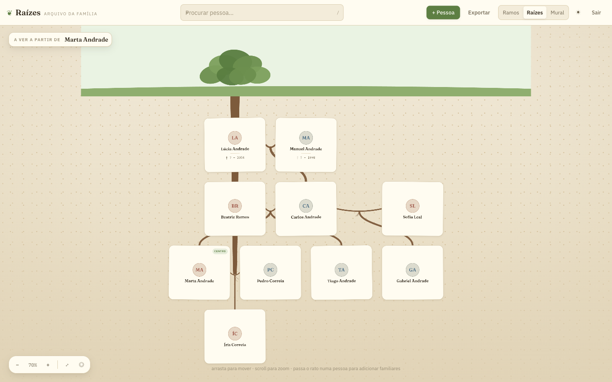

# Raízes

Construtor de árvores genealógicas que corre na tua máquina. Tela de arrastar e
ampliar, ramos desenhados em SVG orgânico, três temas — e a base de dados é um
ficheiro SQLite na pasta `data/`. Nada sai do computador.



## Porque existe

As apps de genealogia querem a tua família na nuvem delas. Esta não: a árvore é
um ficheiro que podes copiar para uma pen, e o código está todo aqui.

## O que faz

- **Tela infinita** — arrasta para mover, scroll para ampliar, `0` para ver a
  árvore toda, `C` para voltar ao centro.
- **Três temas** — `Ramos` (luz de jardim, ramos lenhosos), `Raízes` (a árvore
  à superfície e a família a crescer como raízes) e `Mural` (cortiça e fio
  vermelho, quadro de investigação).
- **Famílias reais** — segundas uniões, meios-irmãos, pais sem parceiro
  registado, pessoas falecidas.
- **Ficha por pessoa** — datas e locais de nascimento e morte, profissão,
  biografia, fotografia.
- **Recentrar em qualquer pessoa** — duplo-clique numa ficha e a árvore
  reorganiza-se a partir dela.
- **Exportar tudo em JSON** — os teus dados saem à mesma velocidade a que
  entraram.
- **Palavra-passe única** — a app não tem contas; protege-se com uma
  palavra-passe partilhada pela família.

## Stack

Next.js 14 (App Router) · TypeScript · SQLite via `better-sqlite3` · Tailwind CSS

## Correr

Precisas de Node 20 ou superior.

```bash
git clone https://github.com/kwana117/raizes.git
cd raizes
npm install
cp .env.local.example .env.local
```

Preenche o `.env.local`:

```bash
APP_PASSWORD=escolhe-uma-palavra-passe
SESSION_TOKEN=$(openssl rand -hex 32)
```

Depois:

```bash
npm run dev
```

Abre <http://localhost:3000>. O esquema da base de dados é criado sozinho na
primeira utilização, em `data/raizes.db`.

### Semente de demonstração (opcional)

Para ver a app com uma árvore já montada — família fictícia, com segundas
uniões e três gerações:

```bash
node scripts/seed-demo.cjs
```

> Apaga tudo o que estiver na base antes de inserir. Não correr por cima de
> dados reais.

## Dados e privacidade

- A base de dados (`data/raizes.db`) e as fotografias (`data/media/`) ficam
  fora do controlo de versões — a pasta `data/` está no `.gitignore`.
- Não há telemetria, analytics nem chamadas a serviços externos.
- Se alojares isto num servidor, a única barreira é o `APP_PASSWORD`. Põe-no
  atrás de HTTPS e escolhe uma palavra-passe a sério.
- Uma árvore genealógica é informação pessoal de gente que não és tu. Antes de
  publicares seja o que for, pergunta.

## Licença

MIT — ver [LICENSE](LICENSE).
